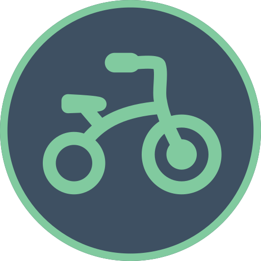

# Bike Worcester branding

[< Back to BikeBus logo resources](./bikebus-logo.md)

---

## Badge only images
Smaller sized logo where ledgibility is difficult (website favicons, for example), or if logo appears near to &quot;BikeBus&quot; text.

### 16w

### 32w

### 64w

### 512w

---
## Black
### 16w

### 32w

### 64w

### 512w

---
## White
### 16w

### 32w

### 64w

### 512w

