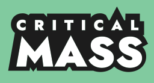
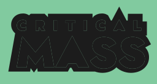
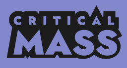

# Bike Worcester branding

[< Back to asset list](./index.md)

---

## Critical Mass logo resources

### Table of contents

- [Default sticker](#)
- [Sticker in various colours](#)
- [Sticker in two colours](#)
- [Sticker in monochrome](#)
- [Titles on black](#)
- [Titles on white](#)
- [Colours](#colours)
- [Typography](#typography)

### Default sticker
The default sticker design in Bike Worcester colours

[⬆️ Back to top](#table-of-contents)

| Preview | Formats |
| ------- | ------- |
|  | &bull; [512w](../assets/critical_mass-logo/critical_mass-logo-full-512.png) &bull; [1024w](../assets/critical_mass-logo/critical_mass-logo-full-1024.png) &bull; [2048w](../assets/critical_mass-logo/critical_mass-logo-full-2048.png) &bull; [Scalable SVG](../assets/critical_mass-logo/critical_mass-logo-full.svg) &bull; |

[⬆️ Back to top](#table-of-contents)
### Sticker in various colours
Various colour options for the sticker design, for use on the standard BW background.

[⬆️ Back to top](#table-of-contents)

| Preview | Formats |
| ------- | ------- |
|  | &bull; [512w](../assets/critical_mass-logo/critical_mass-logo-sticker-512.png) &bull; [1024w](../assets/critical_mass-logo/critical_mass-logo-sticker-1024.png) &bull; [2048w](../assets/critical_mass-logo/critical_mass-logo-sticker-2048.png) &bull; [Scalable SVG](../assets/critical_mass-logo/critical_mass-logo-sticker.svg) &bull; |
  |  | &bull; [512w](../assets/critical_mass-logo/critical_mass-logo-sticker-3E5062-512.png) &bull; [1024w](../assets/critical_mass-logo/critical_mass-logo-sticker-3E5062-1024.png) &bull; [2048w](../assets/critical_mass-logo/critical_mass-logo-sticker-3E5062-2048.png) &bull; [Scalable SVG](../assets/critical_mass-logo/critical_mass-logo-sticker-3E5062.svg) &bull; |
  |  | &bull; [512w](../assets/critical_mass-logo/critical_mass-logo-sticker-81CA9F-512.png) &bull; [1024w](../assets/critical_mass-logo/critical_mass-logo-sticker-81CA9F-1024.png) &bull; [2048w](../assets/critical_mass-logo/critical_mass-logo-sticker-81CA9F-2048.png) &bull; [Scalable SVG](../assets/critical_mass-logo/critical_mass-logo-sticker-81CA9F.svg) &bull; |
  |  | &bull; [512w](../assets/critical_mass-logo/critical_mass-logo-sticker-623E62-512.png) &bull; [1024w](../assets/critical_mass-logo/critical_mass-logo-sticker-623E62-1024.png) &bull; [2048w](../assets/critical_mass-logo/critical_mass-logo-sticker-623E62-2048.png) &bull; [Scalable SVG](../assets/critical_mass-logo/critical_mass-logo-sticker-623E62.svg) &bull; |
  |  | &bull; [512w](../assets/critical_mass-logo/critical_mass-logo-sticker-3E623E-512.png) &bull; [1024w](../assets/critical_mass-logo/critical_mass-logo-sticker-3E623E-1024.png) &bull; [2048w](../assets/critical_mass-logo/critical_mass-logo-sticker-3E623E-2048.png) &bull; [Scalable SVG](../assets/critical_mass-logo/critical_mass-logo-sticker-3E623E.svg) &bull; |
  |  | &bull; [512w](../assets/critical_mass-logo/critical_mass-logo-sticker-8187CA-512.png) &bull; [1024w](../assets/critical_mass-logo/critical_mass-logo-sticker-8187CA-1024.png) &bull; [2048w](../assets/critical_mass-logo/critical_mass-logo-sticker-8187CA-2048.png) &bull; [Scalable SVG](../assets/critical_mass-logo/critical_mass-logo-sticker-8187CA.svg) &bull; |
  |  | &bull; [512w](../assets/critical_mass-logo/critical_mass-logo-sticker-CA81AC-512.png) &bull; [1024w](../assets/critical_mass-logo/critical_mass-logo-sticker-CA81AC-1024.png) &bull; [2048w](../assets/critical_mass-logo/critical_mass-logo-sticker-CA81AC-2048.png) &bull; [Scalable SVG](../assets/critical_mass-logo/critical_mass-logo-sticker-CA81AC.svg) &bull; |
  |  | &bull; [512w](../assets/critical_mass-logo/critical_mass-logo-sticker-CAC381-512.png) &bull; [1024w](../assets/critical_mass-logo/critical_mass-logo-sticker-CAC381-1024.png) &bull; [2048w](../assets/critical_mass-logo/critical_mass-logo-sticker-CAC381-2048.png) &bull; [Scalable SVG](../assets/critical_mass-logo/critical_mass-logo-sticker-CAC381.svg) &bull; |
  |  | &bull; [512w](../assets/critical_mass-logo/critical_mass-logo-sticker-1C1C1C-512.png) &bull; [1024w](../assets/critical_mass-logo/critical_mass-logo-sticker-1C1C1C-1024.png) &bull; [2048w](../assets/critical_mass-logo/critical_mass-logo-sticker-1C1C1C-2048.png) &bull; [Scalable SVG](../assets/critical_mass-logo/critical_mass-logo-sticker-1C1C1C.svg) &bull; |
  |  | &bull; [512w](../assets/critical_mass-logo/critical_mass-logo-sticker-FFFFFF-512.png) &bull; [1024w](../assets/critical_mass-logo/critical_mass-logo-sticker-FFFFFF-1024.png) &bull; [2048w](../assets/critical_mass-logo/critical_mass-logo-sticker-FFFFFF-2048.png) &bull; [Scalable SVG](../assets/critical_mass-logo/critical_mass-logo-sticker-FFFFFF.svg) &bull; |

[⬆️ Back to top](#table-of-contents)
### Sticker in two colours
Two colour sticker design for use on coloured backgrounds.

[⬆️ Back to top](#table-of-contents)

| Preview | Formats |
| ------- | ------- |
|  | &bull; [512w](../assets/critical_mass-logo/critical_mass-logo-sticker-2col-512.png) &bull; [1024w](../assets/critical_mass-logo/critical_mass-logo-sticker-2col-1024.png) &bull; [2048w](../assets/critical_mass-logo/critical_mass-logo-sticker-2col-2048.png) &bull; [Scalable SVG](../assets/critical_mass-logo/critical_mass-logo-sticker-2col.svg) &bull; |
  |  | &bull; [512w](../assets/critical_mass-logo/critical_mass-logo-sticker-2col-3E5062-512.png) &bull; [1024w](../assets/critical_mass-logo/critical_mass-logo-sticker-2col-3E5062-1024.png) &bull; [2048w](../assets/critical_mass-logo/critical_mass-logo-sticker-2col-3E5062-2048.png) &bull; [Scalable SVG](../assets/critical_mass-logo/critical_mass-logo-sticker-2col-3E5062.svg) &bull; |
  |  | &bull; [512w](../assets/critical_mass-logo/critical_mass-logo-sticker-2col-81CA9F-512.png) &bull; [1024w](../assets/critical_mass-logo/critical_mass-logo-sticker-2col-81CA9F-1024.png) &bull; [2048w](../assets/critical_mass-logo/critical_mass-logo-sticker-2col-81CA9F-2048.png) &bull; [Scalable SVG](../assets/critical_mass-logo/critical_mass-logo-sticker-2col-81CA9F.svg) &bull; |
  |  | &bull; [512w](../assets/critical_mass-logo/critical_mass-logo-sticker-2col-623E62-512.png) &bull; [1024w](../assets/critical_mass-logo/critical_mass-logo-sticker-2col-623E62-1024.png) &bull; [2048w](../assets/critical_mass-logo/critical_mass-logo-sticker-2col-623E62-2048.png) &bull; [Scalable SVG](../assets/critical_mass-logo/critical_mass-logo-sticker-2col-623E62.svg) &bull; |
  |  | &bull; [512w](../assets/critical_mass-logo/critical_mass-logo-sticker-2col-3E623E-512.png) &bull; [1024w](../assets/critical_mass-logo/critical_mass-logo-sticker-2col-3E623E-1024.png) &bull; [2048w](../assets/critical_mass-logo/critical_mass-logo-sticker-2col-3E623E-2048.png) &bull; [Scalable SVG](../assets/critical_mass-logo/critical_mass-logo-sticker-2col-3E623E.svg) &bull; |
  |  | &bull; [512w](../assets/critical_mass-logo/critical_mass-logo-sticker-2col-8187CA-512.png) &bull; [1024w](../assets/critical_mass-logo/critical_mass-logo-sticker-2col-8187CA-1024.png) &bull; [2048w](../assets/critical_mass-logo/critical_mass-logo-sticker-2col-8187CA-2048.png) &bull; [Scalable SVG](../assets/critical_mass-logo/critical_mass-logo-sticker-2col-8187CA.svg) &bull; |
  |  | &bull; [512w](../assets/critical_mass-logo/critical_mass-logo-sticker-2col-CA81AC-512.png) &bull; [1024w](../assets/critical_mass-logo/critical_mass-logo-sticker-2col-CA81AC-1024.png) &bull; [2048w](../assets/critical_mass-logo/critical_mass-logo-sticker-2col-CA81AC-2048.png) &bull; [Scalable SVG](../assets/critical_mass-logo/critical_mass-logo-sticker-2col-CA81AC.svg) &bull; |
  |  | &bull; [512w](../assets/critical_mass-logo/critical_mass-logo-sticker-2col-CAC381-512.png) &bull; [1024w](../assets/critical_mass-logo/critical_mass-logo-sticker-2col-CAC381-1024.png) &bull; [2048w](../assets/critical_mass-logo/critical_mass-logo-sticker-2col-CAC381-2048.png) &bull; [Scalable SVG](../assets/critical_mass-logo/critical_mass-logo-sticker-2col-CAC381.svg) &bull; |
  |  | &bull; [512w](../assets/critical_mass-logo/critical_mass-logo-sticker-2col-1C1C1C-512.png) &bull; [1024w](../assets/critical_mass-logo/critical_mass-logo-sticker-2col-1C1C1C-1024.png) &bull; [2048w](../assets/critical_mass-logo/critical_mass-logo-sticker-2col-1C1C1C-2048.png) &bull; [Scalable SVG](../assets/critical_mass-logo/critical_mass-logo-sticker-2col-1C1C1C.svg) &bull; |
  |  | &bull; [512w](../assets/critical_mass-logo/critical_mass-logo-sticker-2col-FFFFFF-512.png) &bull; [1024w](../assets/critical_mass-logo/critical_mass-logo-sticker-2col-FFFFFF-1024.png) &bull; [2048w](../assets/critical_mass-logo/critical_mass-logo-sticker-2col-FFFFFF-2048.png) &bull; [Scalable SVG](../assets/critical_mass-logo/critical_mass-logo-sticker-2col-FFFFFF.svg) &bull; |

[⬆️ Back to top](#table-of-contents)
### Sticker in monochrome
Monochrome sticker design for use on coloured backgrounds.

[⬆️ Back to top](#table-of-contents)

| Preview | Formats |
| ------- | ------- |
|  | &bull; [512w](../assets/critical_mass-logo/critical_mass-logo-sticker-mono-512.png) &bull; [1024w](../assets/critical_mass-logo/critical_mass-logo-sticker-mono-1024.png) &bull; [2048w](../assets/critical_mass-logo/critical_mass-logo-sticker-mono-2048.png) &bull; [Scalable SVG](../assets/critical_mass-logo/critical_mass-logo-sticker-mono.svg) &bull; |
  |  | &bull; [512w](../assets/critical_mass-logo/critical_mass-logo-sticker-mono-3E5062-512.png) &bull; [1024w](../assets/critical_mass-logo/critical_mass-logo-sticker-mono-3E5062-1024.png) &bull; [2048w](../assets/critical_mass-logo/critical_mass-logo-sticker-mono-3E5062-2048.png) &bull; [Scalable SVG](../assets/critical_mass-logo/critical_mass-logo-sticker-mono-3E5062.svg) &bull; |
  |  | &bull; [512w](../assets/critical_mass-logo/critical_mass-logo-sticker-mono-81CA9F-512.png) &bull; [1024w](../assets/critical_mass-logo/critical_mass-logo-sticker-mono-81CA9F-1024.png) &bull; [2048w](../assets/critical_mass-logo/critical_mass-logo-sticker-mono-81CA9F-2048.png) &bull; [Scalable SVG](../assets/critical_mass-logo/critical_mass-logo-sticker-mono-81CA9F.svg) &bull; |
  |  | &bull; [512w](../assets/critical_mass-logo/critical_mass-logo-sticker-mono-623E62-512.png) &bull; [1024w](../assets/critical_mass-logo/critical_mass-logo-sticker-mono-623E62-1024.png) &bull; [2048w](../assets/critical_mass-logo/critical_mass-logo-sticker-mono-623E62-2048.png) &bull; [Scalable SVG](../assets/critical_mass-logo/critical_mass-logo-sticker-mono-623E62.svg) &bull; |
  |  | &bull; [512w](../assets/critical_mass-logo/critical_mass-logo-sticker-mono-3E623E-512.png) &bull; [1024w](../assets/critical_mass-logo/critical_mass-logo-sticker-mono-3E623E-1024.png) &bull; [2048w](../assets/critical_mass-logo/critical_mass-logo-sticker-mono-3E623E-2048.png) &bull; [Scalable SVG](../assets/critical_mass-logo/critical_mass-logo-sticker-mono-3E623E.svg) &bull; |
  |  | &bull; [512w](../assets/critical_mass-logo/critical_mass-logo-sticker-mono-8187CA-512.png) &bull; [1024w](../assets/critical_mass-logo/critical_mass-logo-sticker-mono-8187CA-1024.png) &bull; [2048w](../assets/critical_mass-logo/critical_mass-logo-sticker-mono-8187CA-2048.png) &bull; [Scalable SVG](../assets/critical_mass-logo/critical_mass-logo-sticker-mono-8187CA.svg) &bull; |
  |  | &bull; [512w](../assets/critical_mass-logo/critical_mass-logo-sticker-mono-CA81AC-512.png) &bull; [1024w](../assets/critical_mass-logo/critical_mass-logo-sticker-mono-CA81AC-1024.png) &bull; [2048w](../assets/critical_mass-logo/critical_mass-logo-sticker-mono-CA81AC-2048.png) &bull; [Scalable SVG](../assets/critical_mass-logo/critical_mass-logo-sticker-mono-CA81AC.svg) &bull; |
  |  | &bull; [512w](../assets/critical_mass-logo/critical_mass-logo-sticker-mono-CAC381-512.png) &bull; [1024w](../assets/critical_mass-logo/critical_mass-logo-sticker-mono-CAC381-1024.png) &bull; [2048w](../assets/critical_mass-logo/critical_mass-logo-sticker-mono-CAC381-2048.png) &bull; [Scalable SVG](../assets/critical_mass-logo/critical_mass-logo-sticker-mono-CAC381.svg) &bull; |
  |  | &bull; [512w](../assets/critical_mass-logo/critical_mass-logo-sticker-mono-1C1C1C-512.png) &bull; [1024w](../assets/critical_mass-logo/critical_mass-logo-sticker-mono-1C1C1C-1024.png) &bull; [2048w](../assets/critical_mass-logo/critical_mass-logo-sticker-mono-1C1C1C-2048.png) &bull; [Scalable SVG](../assets/critical_mass-logo/critical_mass-logo-sticker-mono-1C1C1C.svg) &bull; |
  |  | &bull; [512w](../assets/critical_mass-logo/critical_mass-logo-sticker-mono-FFFFFF-512.png) &bull; [1024w](../assets/critical_mass-logo/critical_mass-logo-sticker-mono-FFFFFF-1024.png) &bull; [2048w](../assets/critical_mass-logo/critical_mass-logo-sticker-mono-FFFFFF-2048.png) &bull; [Scalable SVG](../assets/critical_mass-logo/critical_mass-logo-sticker-mono-FFFFFF.svg) &bull; |

[⬆️ Back to top](#table-of-contents)
### Titles on black
Lighter colour logo on black for 16:9 video titles.

[⬆️ Back to top](#table-of-contents)

| Preview | Formats |
| ------- | ------- |
|  | &bull; [1920w](../assets/critical_mass-logo/critical_mass-logo-titles-black-1920.png) &bull; [3840w](../assets/critical_mass-logo/critical_mass-logo-titles-black-3840.png)  &bull; |

[⬆️ Back to top](#table-of-contents)
### Titles on white
Darker colour logo on white for 16:9 video titles.

[⬆️ Back to top](#table-of-contents)

| Preview | Formats |
| ------- | ------- |
|  | &bull; [1920w](../assets/critical_mass-logo/critical_mass-logo-titles-white-1920.png) &bull; [3840w](../assets/critical_mass-logo/critical_mass-logo-titles-white-3840.png)  &bull; |

[⬆️ Back to top](#table-of-contents)

### Colours

[⬆️ Back to top](#table-of-contents)

| #3E5062 |  #81CA9F |  #623E62 |  #3E623E |  #8187CA |  #CA81AC |  #CAC381 |  #1C1C1C |  #FFFFFF | 
| --- |  --- |  --- |  --- |  --- |  --- |  --- |  --- |  --- | 
|  |   |   |   |   |   |   |   |   | 

### Typography

[⬆️ Back to top](#table-of-contents)

| Use | Name | Link |
| --- | --- | --- |
| Logo | Jost Extra Bold | [Link](https://fonts.google.com/specimen/Jost) |
